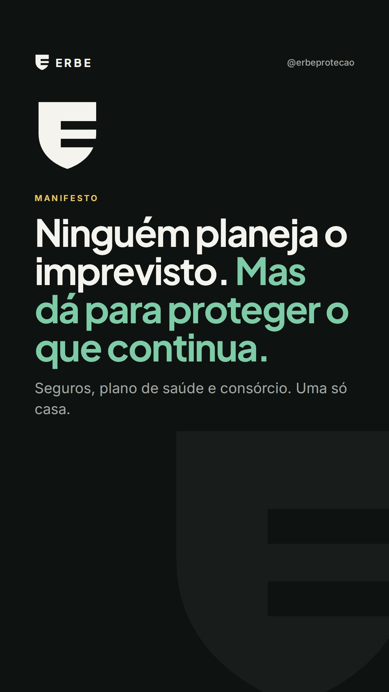
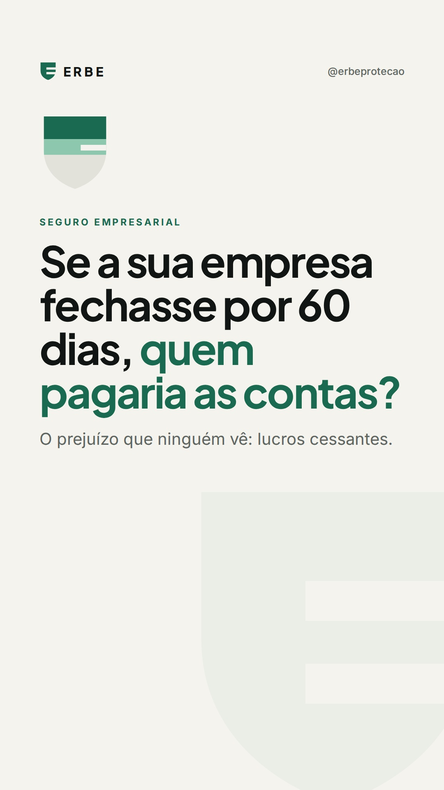
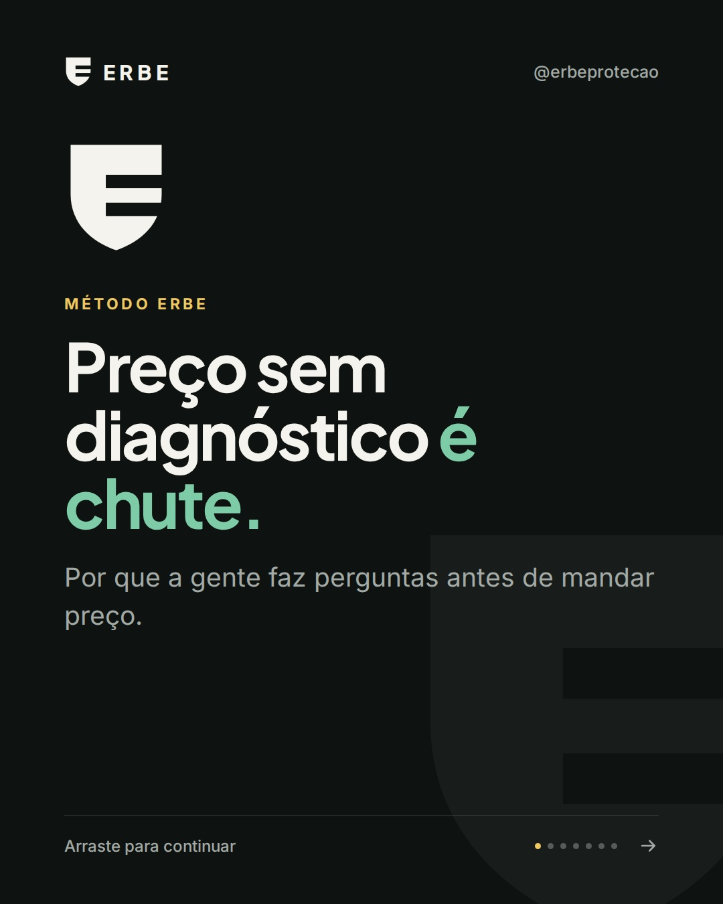
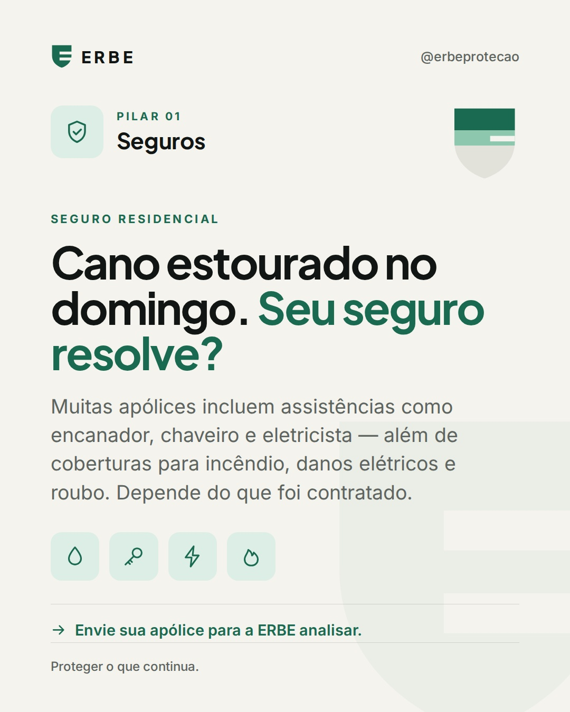
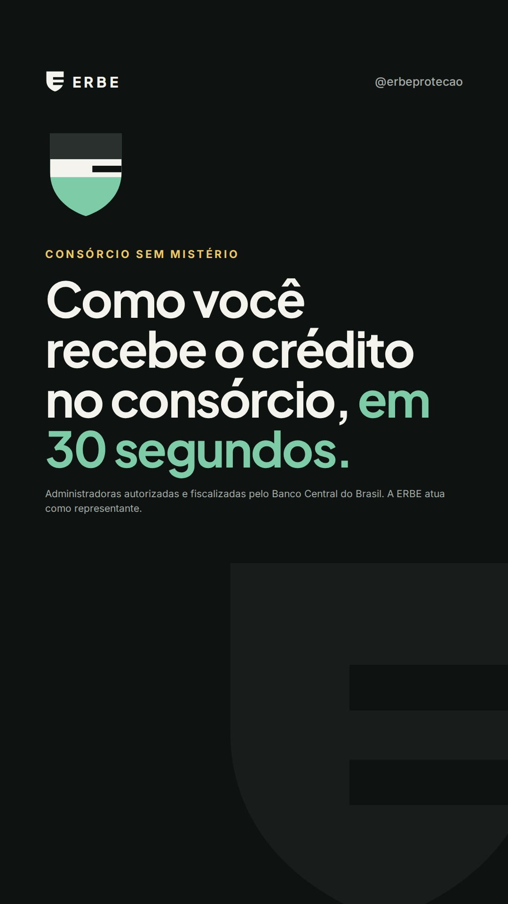
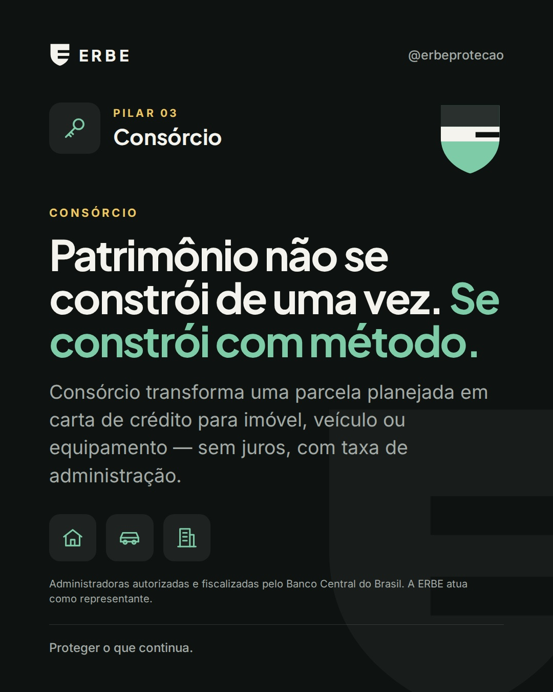
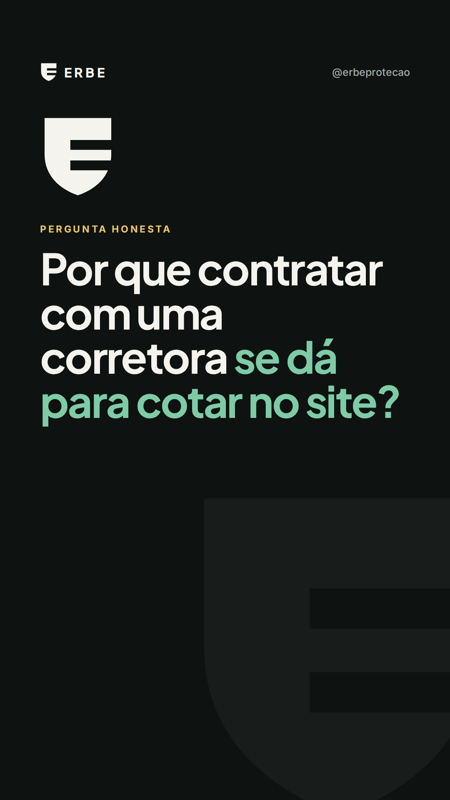
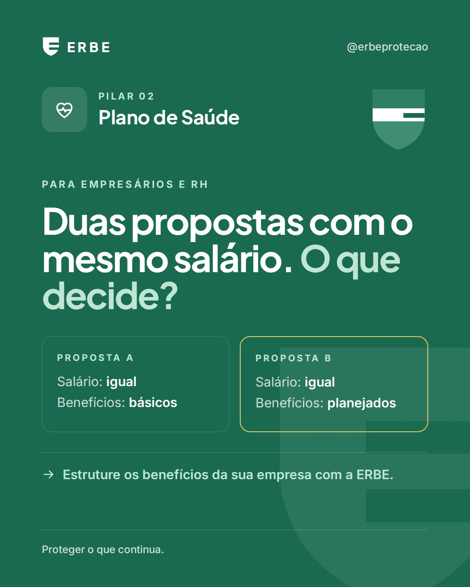
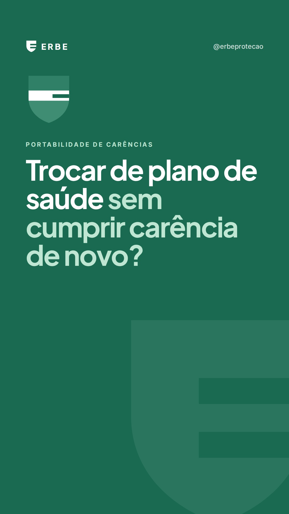
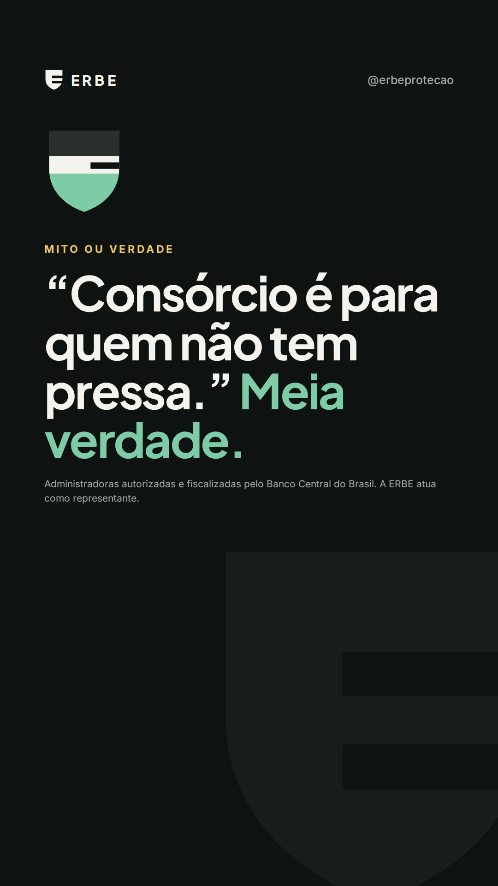

# ERBE — Artes e legendas · outubro de 2026

Artes em JPG de alta qualidade em `artes/<nº>-<tema>/` (feed 1080×1350, Reels e Stories 1080×1920). Cada pasta tem um `legenda.txt` pronto para copiar.
Para alterar um texto, edite `gerador/conteudo.mjs` e rode `node gerador/gerar.mjs <nº>`.

## 01 · Qui 01/10 · Manifesto: proteger o que continua

**Reels** · Institucional · Funil: Topo · Pasta: `artes/01-manifesto/`



**Legenda:**

```
A gente planeja a escola dos filhos, a viagem das férias, a expansão da empresa.

Mas quase ninguém planeja o que protege tudo isso.

Saúde, seguros e consórcio não são produtos soltos. São partes do mesmo plano: cuidar de quem você ama e do que você construiu.

Na ERBE, a gente começa entendendo a sua vida — ou a sua empresa. Só depois recomenda.

Três pilares. Uma só casa. Proteger o que continua.

👉 Siga a ERBE. Todos os dias, um conteúdo para você decidir com mais segurança.

#ERBEProtecaoEPatrimonio #ProtegerOQueContinua #PlanejamentoFinanceiro #PlanoDeSaude #Seguros #Consorcio
```

**Texto na tela (Reels):**

1. Ninguém planeja o imprevisto.
2. A gente planeja a escola, a viagem, a reforma.
3. A expansão, a contratação, o próximo trimestre.
4. Mas quase ninguém planeja o que protege tudo isso.
5. Saúde. Seguros. Consórcio.
6. Não são produtos soltos. São partes do mesmo plano.
7. Três pilares. Uma só casa.
8. ERBE — Proteger o que continua.

## 02 · Sex 02/10 · Carência: os prazos máximos da lei

**Carrossel** · Plano de Saúde · Funil: Topo · Pasta: `artes/02-carencia/`


**Legenda:**

```
Contratou o plano de saúde e já precisa usar? Antes de tudo, entenda a carência.

Carência é o tempo de espera entre a contratação e o direito de usar determinadas coberturas. A lei define prazos máximos:

• 24 horas para urgência e emergência
• 180 dias para as demais coberturas
• 300 dias para parto a termo

Doença preexistente? Pode haver Cobertura Parcial Temporária por até 24 meses para procedimentos ligados a ela.

E em planos empresariais com 30 vidas ou mais, quem entra em até 30 dias da contratação ou da admissão não cumpre carência.

O mais importante: peça por escrito quais carências valem para o seu caso — antes de assinar.

Ficou com dúvida? Fale com a ERBE pelo link na bio. A gente explica cada detalhe.

#ERBEProtecaoEPatrimonio #ProtegerOQueContinua #PlanoDeSaude #Carencia #ANS #SaudeSuplementar
```

## 03 · Sáb 03/10 · Mitos e verdades do seguro de vida

**Carrossel** · Seguros · Funil: Topo · Pasta: `artes/03-mitos-seguro-de-vida/`


**Legenda:**

```
Seguro de vida ainda é cercado de ideias que afastam as pessoas de uma decisão importante.

Neste carrossel, quatro delas — e o que de fato acontece:

• Não serve só em caso de morte: muitas apólices têm coberturas em vida.
• Não entra no inventário: o capital é pago aos beneficiários (Código Civil, art. 794).
• Não é só para quem tem filhos.
• E o valor só dá para saber simulando.

Bônus: beneficiário desatualizado é um erro que passa despercebido. Casou, separou, teve filhos? Revise.

Salve este post e envie para alguém que precisa ler isso.
Quer entender qual proteção faz sentido para você? Fale com a ERBE pelo link na bio.

#ERBEProtecaoEPatrimonio #ProtegerOQueContinua #SeguroDeVida #MitosEVerdades #ProtecaoFamiliar #PlanejamentoFinanceiro
```

## 04 · Dom 04/10 · Outubro Rosa

**Estático** · Plano de Saúde · Funil: Topo · Pasta: `artes/04-outubro-rosa/`


**Legenda:**

```
A gente lembra da consulta dos filhos, dos pais, de todo mundo. E, muitas vezes, esquece da nossa.

Neste Outubro Rosa, o convite é simples: converse com seu médico sobre os exames indicados para você — e agende.

Se você tem plano de saúde e não sabe qual rede usar ou o que está coberto, a ERBE ajuda você a entender.

💗 Compartilhe com uma mulher importante para você.

#ERBEProtecaoEPatrimonio #ProtegerOQueContinua #OutubroRosa #Prevencao #SaudeDaMulher #CuidarDeVoce
```

## 05 · Seg 05/10 · Plano de saúde pelo CNPJ (Dia da Micro e Pequena Empresa)

**Carrossel** · Plano de Saúde · Funil: Fundo · Pasta: `artes/05-plano-pelo-cnpj/`


**Legenda:**

```
Você tem CNPJ, mas o plano de saúde ainda está no seu CPF?

MEIs e pequenas empresas podem contratar planos empresariais — os chamados planos PME. Isso pode mudar as operadoras disponíveis, os valores, as regras para dependentes e a forma de reajuste.

Mas cada operadora tem as suas exigências: tempo mínimo de CNPJ ativo, número mínimo de vidas e vínculo dos beneficiários com a empresa.

Por isso, não existe resposta pronta. Existe comparação feita para o seu caso.

Hoje, 5 de outubro, é Dia Nacional da Micro e Pequena Empresa. Um bom dia para revisar isso.

📲 Responda com PME (aqui nos comentários ou no WhatsApp do link na bio) e receba um estudo para o seu CNPJ.

#ERBEProtecaoEPatrimonio #ProtegerOQueContinua #PlanoPME #MEI #PlanoDeSaudeEmpresarial #PequenasEmpresas #Empreendedorismo
```

## 06 · Ter 06/10 · Empresa parada: quem paga as contas?

**Reels** · Seguros · Funil: Topo · Pasta: `artes/06-seguro-empresarial-lucros-cessantes/`



**Legenda:**

```
Incêndio, alagamento, pane elétrica. O prejuízo não é só o que quebrou. É o que sua empresa deixa de faturar enquanto conserta — com aluguel, salários e fornecedores vencendo normalmente.

O seguro empresarial pode incluir cobertura de lucros cessantes e despesas fixas. Mas só se a apólice for desenhada assim.

A diferença está na hora de montar a proteção, não na hora do sinistro.

💬 Comente EMPRESA e receba o checklist de coberturas para o seu negócio.

#ERBEProtecaoEPatrimonio #ProtegerOQueContinua #SeguroEmpresarial #LucrosCessantes #GestaoDeRiscos #Empresarios
```

**Texto na tela (Reels):**

1. Se a sua empresa fechasse por 60 dias…
2. quem pagaria as contas?
3. Incêndio. Alagamento. Pane elétrica.
4. O prejuízo não é só o que quebrou.
5. É o que você deixa de faturar enquanto conserta.
6. Aluguel, salários e fornecedores continuam.
7. Lucros cessantes e despesas fixas podem estar na apólice.
8. Se ela for montada assim.
9. Comente EMPRESA e receba o checklist.

## 07 · Qua 07/10 · Consórcio x financiamento

**Carrossel** · Consórcio · Funil: Meio · Pasta: `artes/07-consorcio-x-financiamento/`


**Legenda:**

```
Consórcio ou financiamento? Antes de comparar taxas, responda: quando você precisa do bem?

Financiamento entrega o crédito na hora, com juros.
Consórcio não tem juros, tem taxa de administração — e o crédito vem na contemplação, por sorteio ou lance.

Nenhum é melhor em tudo. Urgência pede uma solução. Planejamento permite outra.

Fale com a ERBE e compare o custo total antes de decidir. Link na bio.

#ERBEProtecaoEPatrimonio #ProtegerOQueContinua #Consorcio #Financiamento #CartaDeCredito #PlanejamentoFinanceiro
```

## 08 · Qui 08/10 · Método ERBE

**Carrossel** · Institucional · Funil: Meio · Pasta: `artes/08-metodo-erbe/`



**Legenda:**

```
Já pediu uma cotação e recebeu só uma tabela de preços?

Na ERBE, a gente faz perguntas antes. Porque preço sem diagnóstico é chute.

Nosso método:
1. Diagnóstico
2. Análise de mercado
3. Estudo escrito, com as opções lado a lado e o motivo da recomendação
4. Implantação
5. Acompanhamento

Proteção bem feita não termina na assinatura. Ela continua nas renovações, nos reajustes e no dia em que você precisa usar.

Quer começar pelo diagnóstico? Fale com a ERBE pelo link na bio.

#ERBEProtecaoEPatrimonio #ProtegerOQueContinua #Consultoria #CorretoraDeSeguros #PlanoDeSaude #Consorcio
```

## 09 · Sex 09/10 · 5 erros das empresas no plano de saúde

**Reels** · Plano de Saúde · Funil: Meio · Pasta: `artes/09-erros-empresas-plano-de-saude/`


**Legenda:**

```
Plano de saúde empresarial não pesa só pelo preço. Pesa pelas decisões tomadas — ou não tomadas — ao longo do contrato.

5 erros comuns:
1. Escolher só pela mensalidade do primeiro ano
2. Contratar uma rede que não atende onde a equipe mora
3. Não definir regras de elegibilidade (dependentes, agregados)
4. Ler a cláusula de reajuste só na renovação
5. Não acompanhar a utilização ao longo do ano

Se reconheceu pelo menos um, vale uma conversa antes da próxima renovação. Fale com a ERBE pelo link na bio.

#ERBEProtecaoEPatrimonio #ProtegerOQueContinua #PlanoDeSaudeEmpresarial #RH #BeneficiosCorporativos #GestaoDePessoas
```

**Texto na tela (Reels):**

1. 5 erros que pesam no plano de saúde da sua empresa
2. 1. Escolher só pela mensalidade do primeiro ano
3. 2. Rede que não atende onde a equipe mora
4. 3. Regras de elegibilidade indefinidas
5. 4. Ler a cláusula de reajuste só na renovação
6. 5. Não acompanhar a utilização
7. Se reconheceu algum? Fale com a ERBE.

## 10 · Sáb 10/10 · Seguro residencial além do incêndio

**Estático** · Seguros · Funil: Topo · Pasta: `artes/10-seguro-residencial/`



**Legenda:**

```
Domingo, 8 da manhã. Um cano estoura na cozinha.

Muita gente não sabe, mas várias apólices de seguro residencial incluem assistências como encanador, chaveiro e eletricista — além das coberturas para incêndio, danos elétricos e roubo.

Tudo depende do que foi contratado. E é justamente aí que pouca gente olha.

Não sabe o que o seu cobre? Envie sua apólice para a ERBE analisar. Link na bio.

#ERBEProtecaoEPatrimonio #ProtegerOQueContinua #SeguroResidencial #Casa #Assistencia24h #ProtecaoFamiliar
```

## 11 · Dom 11/10 · Contemplação explicada em 30 segundos

**Reels** · Consórcio · Funil: Topo · Pasta: `artes/11-contemplacao-consorcio/`



**Legenda:**

```
Consórcio é um grupo de pessoas com o mesmo objetivo, contribuindo todo mês.

A cada assembleia, há contemplações por sorteio e por lance. O lance é antecipar parte das parcelas — e as regras (livre, fixo ou embutido) variam conforme a administradora.

Contemplado, o crédito passa por análise e você compra o bem à vista.

Sem juros. Com planejamento.

Salve para consultar depois — e, quando quiser simular, fale com a ERBE.

#ERBEProtecaoEPatrimonio #ProtegerOQueContinua #Consorcio #Contemplacao #CartaDeCredito #ConsorcioImobiliario
```

**Texto na tela (Reels):**

1. Como você recebe o crédito no consórcio?
2. Um grupo de pessoas contribui todo mês.
3. A cada assembleia: contemplação por sorteio…
4. …e por lance.
5. Lance = antecipar parte das parcelas.
6. Livre, fixo ou embutido: depende da administradora.
7. Contemplado, o crédito passa por análise.
8. E você compra o bem à vista.
9. Sem juros. Com planejamento.

## 12 · Seg 12/10 · Dia das Crianças: quem protege o seu plano?

**Estático** · Seguros · Funil: Topo · Pasta: `artes/12-dia-das-criancas/`


**Legenda:**

```
Escola, sonhos, viagens, a primeira bicicleta, a faculdade. A gente planeja tudo isso para eles.

Mas todo plano depende de uma rotina que continua — mesmo quando algo sai do controle.

Seguro de vida não é sobre ausência. É sobre garantir que os planos da sua família sigam em frente.

Feliz Dia das Crianças.

Fale com a ERBE e entenda qual proteção faz sentido para a sua família. Link na bio.

#ERBEProtecaoEPatrimonio #ProtegerOQueContinua #DiaDasCriancas #SeguroDeVida #Familia #ProtecaoFamiliar
```

## 13 · Ter 13/10 · Coparticipação: economia ou armadilha?

**Carrossel** · Plano de Saúde · Funil: Meio · Pasta: `artes/13-coparticipacao/`


**Legenda:**

```
Coparticipação divide opiniões. Para uns, é economia. Para outros, uma conta que cresce sem ninguém ver.

A verdade: depende do perfil de uso.

Pode fazer sentido quando o uso é baixo ou previsível.
Pode pesar quando há tratamentos contínuos ou muitas consultas e exames.

No contrato, confira: quais procedimentos têm coparticipação, se é valor fixo ou percentual e se existe limite por evento ou por período.

A conta certa é o custo total no ano — não só a mensalidade.

Quer simular os dois modelos com o seu perfil? Fale com a ERBE pelo link na bio.

#ERBEProtecaoEPatrimonio #ProtegerOQueContinua #Coparticipacao #PlanoDeSaude #PlanoDeSaudeEmpresarial #RH
```

## 14 · Qua 14/10 · Renda protegida para profissional liberal (DIT)

**Carrossel** · Seguros · Funil: Meio · Pasta: `artes/14-dit-profissional-liberal/`


**Legenda:**

```
Médico, dentista, advogado, arquiteto, consultor: quando a agenda para, a renda para junto.

A DIT — Diária por Incapacidade Temporária — paga diárias enquanto você não pode trabalhar por acidente ou doença, conforme as condições da apólice.

Antes de contratar, olhe a franquia, o limite de diárias e como a renda é comprovada.

E combine com seguro de vida, invalidez e doenças graves para uma proteção mais completa.

📲 Responda com RENDA (nos comentários ou no WhatsApp do link na bio) e receba um estudo de quanto da sua renda dá para proteger.

#ERBEProtecaoEPatrimonio #ProtegerOQueContinua #ProfissionalLiberal #ProtecaoDeRenda #SeguroDeVida #Autonomos
```

## 15 · Qui 15/10 · Plano de saúde para pais com mais de 60

**Carrossel** · Plano de Saúde · Funil: Topo · Pasta: `artes/15-plano-pais-60-mais/`


**Legenda:**

```
Cuidar dos pais também é planejar.

Se você está pensando em um plano de saúde para eles depois dos 60, comece por aqui:

• Não há idade máxima para contratar.
• A última faixa etária de reajuste é aos 59 anos (planos contratados a partir de 2004). O reajuste anual continua.
• Doenças preexistentes devem ser declaradas, e pode haver cobertura parcial temporária.
• Rede e região fazem toda a diferença.
• Em alguns contratos empresariais, pais podem entrar como dependentes ou agregados.

Cada família tem um caminho. Fale com a ERBE e veja quais existem para os seus pais. Link na bio.

#ERBEProtecaoEPatrimonio #ProtegerOQueContinua #PlanoDeSaude #Idosos #CuidarDosPais #Familia
```

## 16 · Sex 16/10 · Você sabe o que seu seguro cobre?

**Story** · Seguros · Funil: Fundo · Pasta: `artes/16-stories-revisao-de-seguros/`


**Stickers (Stories):**

- Story 01: sticker de ENQUETE no espaço inferior — opções "Sim" e "Mais ou menos".
- Story 02: sem sticker (ou sticker de reação/emoji deslizante "quanto isso te preocupa?").
- Story 03: sticker de QUIZ no espaço inferior — "Para os herdeiros, pela lei" (correta) / "Para o Estado" / "Ninguém recebe".
- Story 04: sem sticker.
- Story 05: sticker de LINK no espaço inferior — texto "Quero revisar meus seguros" → WhatsApp da ERBE com mensagem pronta. Se o diagnóstico for sem custo, acrescente esse destaque no texto do sticker.

## 17 · Sáb 17/10 · Patrimônio se constrói com método

**Estático** · Consórcio · Funil: Topo · Pasta: `artes/17-patrimonio-com-metodo/`



**Legenda:**

```
Patrimônio raramente nasce de uma grande tacada. Ele se constrói com decisões consistentes.

O consórcio transforma uma parcela planejada em carta de crédito para imóvel, veículo ou equipamento — sem juros, com taxa de administração.

É uma ferramenta para quem pensa no próximo passo antes de precisar dar.

Salve este post e, quando quiser simular, fale com a ERBE.

#ERBEProtecaoEPatrimonio #ProtegerOQueContinua #Patrimonio #Consorcio #ConsorcioImobiliario #PlanejamentoFinanceiro
```

## 18 · Dom 18/10 · Por que contratar com uma corretora?

**Reels** · Institucional · Funil: Meio · Pasta: `artes/18-por-que-corretora/`



**Legenda:**

```
Cotar no site é rápido. Mas o site mostra um produto. A corretora compara vários.

E o trabalho não termina na assinatura: explicar o contrato, ajudar no reembolso e no sinistro, incluir dependentes, acompanhar reajustes e renovações.

O preço é só o começo da relação.

Fale com a ERBE e veja a diferença de ter alguém do seu lado. Link na bio.

#ERBEProtecaoEPatrimonio #ProtegerOQueContinua #CorretoraDeSeguros #Consultoria #PlanoDeSaude #Seguros
```

**Texto na tela (Reels):**

1. Por que contratar com uma corretora se dá para cotar no site?
2. O site mostra um produto. A corretora compara vários.
3. Traduz o contrato antes da assinatura.
4. Ajuda no sinistro, no reembolso, na inclusão de dependentes.
5. Acompanha reajustes e renovações.
6. O preço é só o começo da relação.
7. Fale com a ERBE.

## 19 · Seg 19/10 · Mesmo salário, duas propostas: o que decide?

**Estático** · Plano de Saúde · Funil: Topo · Pasta: `artes/19-beneficios-e-retencao/`



**Legenda:**

```
Duas propostas. O mesmo salário. Qual delas o profissional escolhe?

Benefícios bem estruturados entram na conta de quem decide onde trabalhar — e de quem decide ficar.

Plano de saúde, seguro de vida em grupo e outras proteções podem fazer parte de uma política de benefícios planejada para o orçamento da empresa.

Fale com a ERBE para estruturar o pacote de benefícios da sua empresa. Link na bio.

#ERBEProtecaoEPatrimonio #ProtegerOQueContinua #BeneficiosCorporativos #RH #RetencaoDeTalentos #PlanoDeSaudeEmpresarial
```

## 20 · Ter 20/10 · Seguro de vida em grupo e convenção coletiva

**Carrossel** · Seguros · Funil: Fundo · Pasta: `artes/20-vida-em-grupo-convencao/`


**Legenda:**

```
Empresário, RH, contador: já conferiu se a convenção coletiva da categoria exige seguro de vida para os colaboradores?

Algumas exigem — com coberturas e valores mínimos definidos. E não cumprir pode gerar passivo trabalhista.

Mais que obrigação, o seguro de vida em grupo é um benefício que protege a família de quem trabalha com você.

📲 Envie a convenção e o número de colaboradores para a ERBE (link na bio). A gente verifica as exigências e devolve um estudo com as opções.

#ERBEProtecaoEPatrimonio #ProtegerOQueContinua #SeguroDeVidaEmGrupo #ConvencaoColetiva #RH #Contabilidade #BeneficiosCorporativos
```

## 21 · Qua 21/10 · Frota e máquinas com consórcio

**Carrossel** · Consórcio · Funil: Meio · Pasta: `artes/21-consorcio-frota-e-maquinas/`


**Legenda:**

```
Frota parada custa caro. Frota renovada com juros também.

O consórcio pode ser uma ferramenta para renovar veículos, caminhões, máquinas e equipamentos de forma planejada:
• Cotas com prazos diferentes para renovação escalonada
• Lance para tentar antecipar a contemplação
• Crédito à vista para negociar com o fornecedor

Pontos de atenção: a contemplação não tem data garantida, há análise de crédito, taxa de administração e correção das parcelas.

Consórcio funciona melhor dentro de um plano. Fale com a ERBE e monte o seu. Link na bio.

#ERBEProtecaoEPatrimonio #ProtegerOQueContinua #ConsorcioDePesados #Frota #Transportadora #Industria #Consorcio
```

## 22 · Qui 22/10 · Vazou um dado: quem paga a conta?

**Reels** · Seguros · Funil: Topo · Pasta: `artes/22-seguro-cyber/`


**Legenda:**

```
Um incidente com dados não é só problema de TI. Envolve investigação técnica, notificação de clientes, defesa jurídica, possíveis sanções da LGPD e sistema fora do ar.

O seguro cyber pode cobrir parte desses custos, conforme a apólice. E quando a decisão de um gestor é questionada, o tema passa a ser D&O.

💬 Comente CYBER e receba os pontos que uma apólice precisa ter.

#ERBEProtecaoEPatrimonio #ProtegerOQueContinua #SeguroCyber #LGPD #Tecnologia #Startups #DeO
```

**Texto na tela (Reels):**

1. Vazou um dado de cliente. Quem paga a conta?
2. Investigação técnica.
3. Notificação de clientes.
4. Defesa jurídica.
5. Possíveis sanções da LGPD.
6. Sistema fora do ar.
7. Não é só problema de TI. É problema de caixa.
8. Seguro cyber pode cobrir parte desses custos.
9. Comente CYBER.

## 23 · Sex 23/10 · Portabilidade de carências

**Reels** · Plano de Saúde · Funil: Meio · Pasta: `artes/23-portabilidade-de-carencias/`



**Legenda:**

```
Insatisfeito com o plano de saúde, mas com medo de cumprir carência de novo?

Em muitos casos, existe a portabilidade de carências, regulamentada pela ANS. Os requisitos gerais incluem estar com os pagamentos em dia, cumprir um tempo mínimo no plano atual e escolher um plano de destino compatível.

Cada caso tem detalhes — e um erro no processo pode atrasar ou inviabilizar a troca.

📲 Mande PORTABILIDADE no WhatsApp (link na bio) e a ERBE analisa o seu caso.

#ERBEProtecaoEPatrimonio #ProtegerOQueContinua #PortabilidadeDeCarencias #PlanoDeSaude #ANS #Carencia
```

**Texto na tela (Reels):**

1. Dá para trocar de plano sem cumprir carência de novo?
2. Em muitos casos, sim.
3. É a portabilidade de carências, regulamentada pela ANS.
4. Pagamentos em dia.
5. Tempo mínimo no plano atual.
6. Plano de destino compatível.
7. Um erro no processo pode atrasar ou inviabilizar a troca.
8. Mande PORTABILIDADE no WhatsApp.

## 24 · Sáb 24/10 · "Consórcio é para quem não tem pressa"?

**Reels** · Consórcio · Funil: Meio · Pasta: `artes/24-consorcio-meia-verdade/`



**Legenda:**

```
"Consórcio é para quem não tem pressa." Meia verdade.

Consórcio é para quem tem planejamento. Com lance, é possível tentar antecipar a contemplação — sem garantia de data. E há estratégias: reserva para lance, lance embutido (quando a administradora permite) e escolha do prazo certo.

O erro não é entrar no consórcio. É entrar sem estratégia.

Fale com a ERBE e monte a sua antes de escolher a cota. Link na bio.

#ERBEProtecaoEPatrimonio #ProtegerOQueContinua #Consorcio #Lance #Contemplacao #PlanejamentoFinanceiro
```

**Texto na tela (Reels):**

1. "Consórcio é para quem não tem pressa."
2. Meia verdade.
3. Consórcio é para quem tem planejamento.
4. Com lance, dá para tentar antecipar.
5. Sem garantia de data.
6. Reserva para lance. Lance embutido. Prazo certo.
7. O erro não é entrar no consórcio.
8. É entrar sem estratégia.

## 25 · Dom 25/10 · Case ERBE (exemplo ilustrativo)

**Carrossel** · Institucional · Funil: Fundo · Pasta: `artes/25-case-clinica/`


**Legenda:**

```
Exemplo ilustrativo de uma situação que encontramos com frequência:

Uma clínica com equipe pequena tinha o plano de saúde em dia — e achava que isso bastava.

Na revisão, apareceram pontos que ninguém tinha olhado: responsabilidade civil profissional, exigências da convenção coletiva, proteção do imóvel e dos equipamentos e o plano de saúde sem revisão antes da renovação.

A solução não foi um produto. Foi um plano de proteção, com prioridades definidas por risco e orçamento.

Sua situação é parecida? Fale com a ERBE pelo link na bio.

#ERBEProtecaoEPatrimonio #ProtegerOQueContinua #Clinicas #GestaoDeRiscos #SeguroEmpresarial #Consultoria
```

## 26 · Seg 26/10 · O reajuste chegou: aceitar ou analisar?

**Carrossel** · Plano de Saúde · Funil: Fundo · Pasta: `artes/26-reajuste-plano-empresarial/`


**Legenda:**

```
A carta de reajuste chegou. E agora?

Antes de aceitar, entenda de onde vem o percentual:
• Contratos com menos de 30 vidas: reajuste por agrupamento.
• 30 vidas ou mais: a utilização do contrato pesa — e há espaço para negociar com dados.

O que fazer antes da data de aniversário: pedir o relatório de utilização, comparar com o mercado e rever o desenho do plano. O ideal é começar de 60 a 90 dias antes.

📲 Envie a carta de reajuste para a ERBE (link na bio) e receba um estudo com os caminhos possíveis.

#ERBEProtecaoEPatrimonio #ProtegerOQueContinua #ReajustePlanoDeSaude #PlanoDeSaudeEmpresarial #RH #Financeiro #BeneficiosCorporativos
```

## 27 · Ter 27/10 · Responsabilidade civil profissional para clínicas

**Carrossel** · Seguros · Funil: Meio · Pasta: `artes/27-rc-profissional-clinicas/`


**Legenda:**

```
Na área da saúde, um paciente insatisfeito pode virar um processo — mesmo quando o atendimento foi correto.

O seguro de responsabilidade civil profissional pode cobrir custos de defesa e indenizações, conforme a apólice. E atenção: RC da clínica e RC do profissional são coberturas diferentes.

Na hora de contratar, olhe retroatividade, limite, franquia e período complementar.

Fale com a ERBE e revise a proteção da sua clínica. Link na bio.

#ERBEProtecaoEPatrimonio #ProtegerOQueContinua #RCProfissional #Clinicas #Medicos #Dentistas #SeguroEmpresarial
```

## 28 · Qua 28/10 · Sua apólice de carga acompanhou a operação?

**Carrossel** · Seguros · Funil: Fundo · Pasta: `artes/28-apolice-de-carga/`


**Legenda:**

```
Novas rotas. Novos clientes. Novos tipos de carga. Sua apólice acompanhou?

O transporte rodoviário de cargas tem seguros obrigatórios, e as regras foram atualizadas nos últimos anos. Além disso, averbação, limite por embarque, gerenciamento de risco e mercadorias excluídas são pontos que costumam gerar problema.

E não esqueça: frota, responsabilidade civil e seguro de vida dos motoristas.

📲 Mande sua apólice atual e o perfil das rotas para a ERBE (link na bio). A gente faz a revisão.

#ERBEProtecaoEPatrimonio #ProtegerOQueContinua #SeguroDeCarga #Transportadora #Logistica #TransporteRodoviario
```

## 29 · Qui 29/10 · Simule seu próximo passo

**Story** · Consórcio · Funil: Fundo · Pasta: `artes/29-stories-simulacao-consorcio/`


**Stickers (Stories):**

- Story 01: sticker de ENQUETE no espaço inferior — "Imóvel" / "Veículo" / "Empresa" (a enquete aceita até 4 opções).
- Story 02: sticker de CAIXA DE PERGUNTAS no espaço inferior — "Ex.: R$ 300 mil para um imóvel".
- Story 03: sem sticker.
- Story 04: sem sticker (ou sticker de contagem regressiva, se houver campanha com prazo real).
- Story 05: sticker de LINK no espaço inferior — "Quero simular" → WhatsApp da ERBE com a mensagem pronta de consórcio.

## 30 · Sex 30/10 · Checklist da cotação empresarial

**Carrossel** · Plano de Saúde · Funil: Fundo · Pasta: `artes/30-checklist-cotacao-empresarial/`


**Legenda:**

```
Cotação de plano de saúde empresarial costuma virar um vai e volta de mensagens. Dá para evitar.

Separe:
1. CNPJ e tempo de abertura
2. Número de vidas e datas de nascimento
3. Cidade ou região de atendimento
4. Hospitais e laboratórios essenciais
5. Plano atual (fatura e carta de reajuste), se houver
6. Preferências: acomodação, coparticipação, abrangência

Com isso, a ERBE monta um comparativo claro — não só uma lista de preços.

💬 Responda com COTAÇÃO (nos comentários ou no WhatsApp do link na bio) e receba um estudo. E salve este post para usar depois.

#ERBEProtecaoEPatrimonio #ProtegerOQueContinua #PlanoDeSaudeEmpresarial #CotacaoPlanoDeSaude #PlanoPME #RH #Empresarios
```
